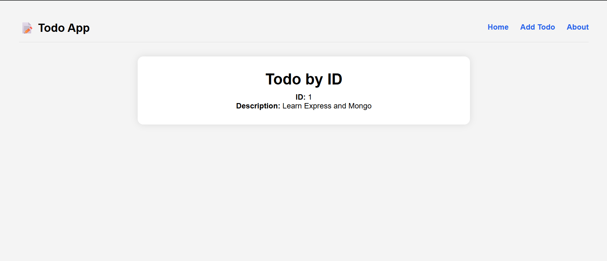

# 📋 Express Todo App

A clean and responsive Todo application built with **Node.js**, **Express.js**, and **EJS** following RESTful principles.

This project was built to learn server-side rendering, routing, CRUD operations, middleware, and project organization in Express.

---

## ✨ Features

- ➕ Add new todos
- 👁 View individual todo details
- ✏ Edit existing todos
- 🗑 Delete todos
- 🎨 Responsive and clean UI
- 🔔 SweetAlert2 delete confirmation
- 🧩 Reusable EJS partials
- 📂 Organized project structure
- ⚡ RESTful routing
- 🔄 Method Override for PATCH & DELETE
- 🎯 Static assets (CSS, JavaScript, Images)

---

## 🛠 Tech Stack

- Node.js
- Express.js
- EJS
- Method Override
- Vanilla JavaScript
- CSS3
- HTML5

---

## 📁 Project Structure

```text
todo-app/
│
├── node_modules/
├── public/
│   ├── css/
│   ├── images/
│   └── js/
│
├── routes/
│   └── todo.js
│
├── views/
│   ├── partials/
│   ├── about.ejs
│   ├── edit.ejs
│   ├── index.ejs
│   └── todo.ejs
│
├── app.js
├── package.json
├── package-lock.json
└── .gitignore
```

---

## 🚀 Installation

Clone the repository

```bash
git clone https://github.com/Akbarhussain973/express-todo-app.git
```

Navigate to the project

```bash
cd express-todo-app
```

Install dependencies

```bash
npm install
```

Start the application

```bash
npm start
```

Visit

```
http://localhost:3000/todos
```

---

## 📸 Screenshots

### Home Page


### Edit Todo


### Todo Details



---

## 📚 What I Learned

During this project I learned:

- Express application setup
- Routing with Express Router
- EJS templating
- Passing data from server to views
- CRUD operations
- RESTful architecture
- Middleware
- Method Override
- Serving static files
- Project organization
- Git & GitHub workflow

---

## 🔮 Future Improvements

- MongoDB Integration
- Mongoose Models
- Persistent Database
- User Authentication
- Session Management
- Search Todos
- Categories & Tags
- Due Dates
- Responsive Mobile Design
- Deployment

---

## 🤝 Contributing

Contributions, suggestions, and improvements are welcome.

Fork the repository and submit a pull request.

---

## 📄 License

This project is open source and available under the MIT License.

---

## 👨‍💻 Author

**Akbar Hussain**

Software Engineering Student | Learning Full Stack Web Development

GitHub:
https://github.com/Akbarhussain973
