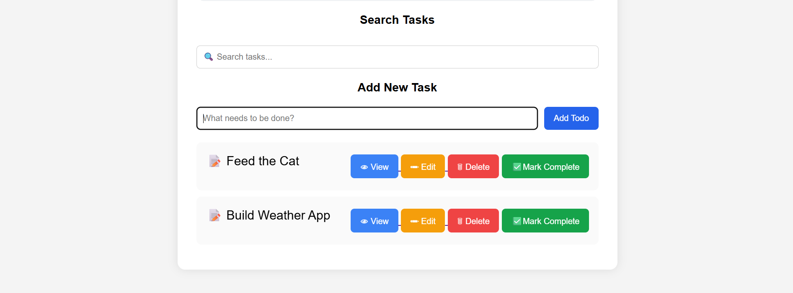
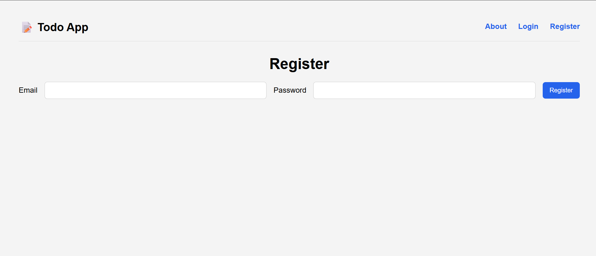
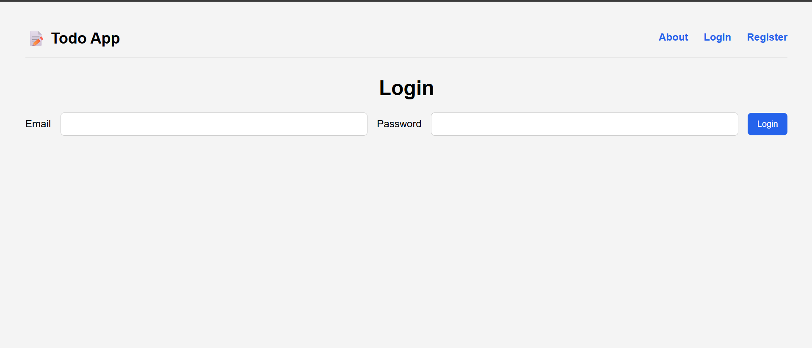
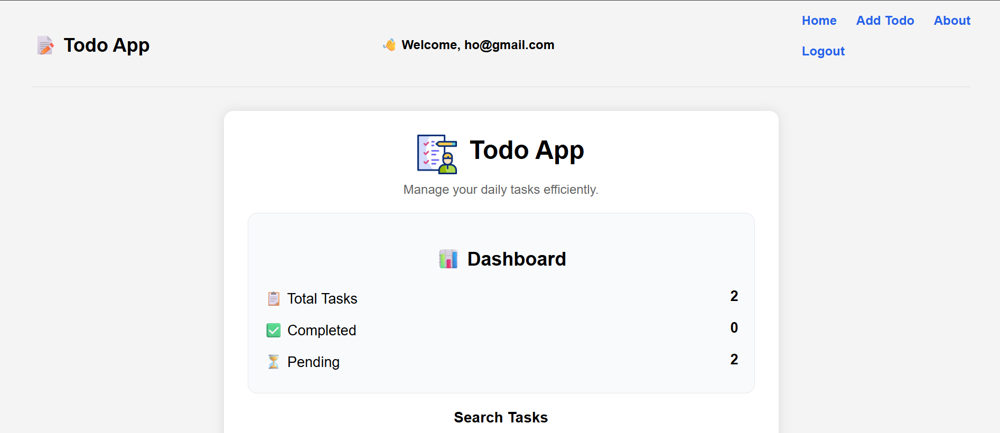
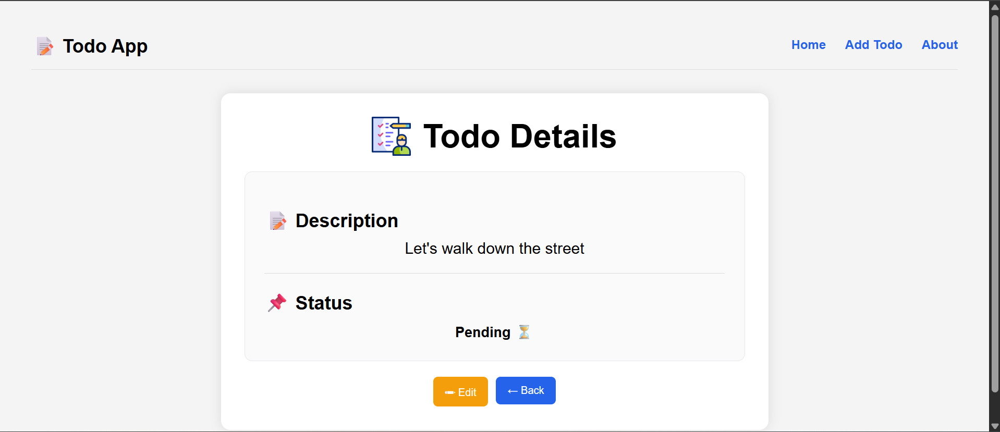
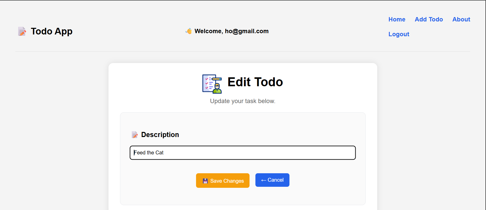
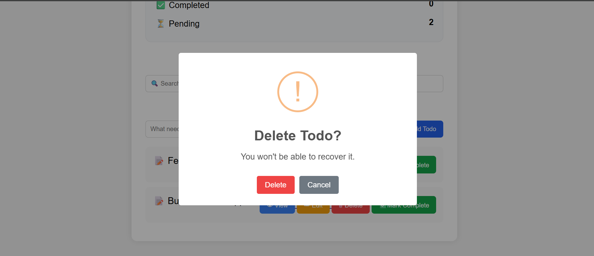
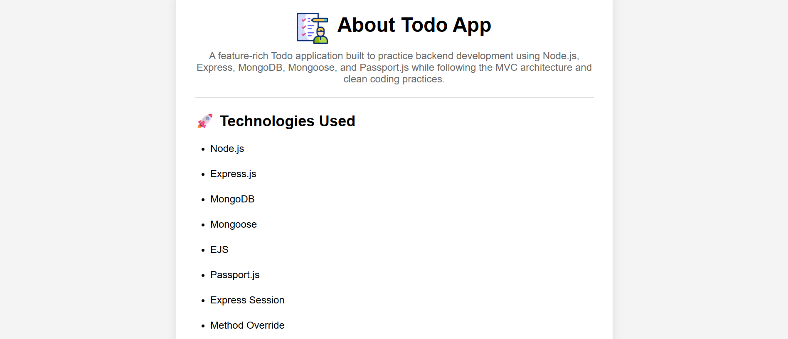

# 📝 Todo App


A production-style full-stack Todo Management Application built with Node.js, Express.js, MongoDB Atlas, Mongoose, Passport.js, and EJS. The project follows the MVC (Model–View–Controller) architecture and demonstrates secure user authentication, session management, server-side validation, responsive UI design, and clean backend organization.

# ⭐ Highlights

- Secure authentication using Passport.js
- Password hashing with Passport Local Mongoose
- Session-based authorization
- Joi request validation
- Protected routes using custom middleware
- Centralized error handling & custom error pages
- Clean MVC architecture
- Cloud-hosted MongoDB Atlas database
- Secure sessions using Express Session
- Environment variable management with Dotenv
- Fully responsive interface
- Deployed on Render

---

# 🌐 Live Demo

🚀 **Live Application**

https://todo-app-yzk2.onrender.com

> **Note**
>
> This application is hosted on **Render's Free Tier**.
>
> The first request after a period of inactivity may take **30–60 seconds** while the server wakes up.

---

## 🎯 Project Overview

This project was built to strengthen my backend engineering skills by implementing authentication, authorization, MVC architecture, server-side validation, session management, and MongoDB integration in a production-style Express application.

## 🏛 Architecture

The application follows the MVC (Model–View–Controller) architecture to keep business logic, routing, database models, and views cleanly separated.

- **Models** – Mongoose schemas and business logic
- **Views** – EJS templates and reusable partials
- **Controllers** – Application logic
- **Routes** – Express routing layer
- **Middleware** – Authentication, validation, and authorization
- **Utilities** – Custom error handling and async wrappers

# 📸 Screenshots

## 🏠 Home


## 👤 Register


## 🔑 Login


## 📊 Dashboard


## 👀 View Todo


## ✏ Edit Todo


## 🗑 Delete Todo


## ℹ About Page


---

## ✨ Features

### Authentication
- User Registration
- User Login & Logout
- Secure Password Hashing (Passport Local Mongoose)
- Session-based Authentication
- Protected Routes with Authentication & Authorization Middleware

### Todo Management
- Create Todos
- View Todo Details
- Edit Todos
- Delete Todos
- Search Todos
- Mark Complete / Pending

### Dashboard
- Total Todos
- Completed Todos
- Pending Todos

### User Experience
- Flash Success & Error Messages
- Responsive Design
- Custom 404 Error Page
- Clean Navigation

### Backend
- MVC Architecture
- Joi Validation
- Custom Error Handling
- Async Error Wrapper
- Mongoose Middleware
- Instance Methods
- Static Methods
- Virtual Properties

### Deployment
- MongoDB Atlas
- Render Deployment
 
---

# 🛠 Tech Stack

| Category | Technologies |
|----------|--------------|
| **Backend** | Node.js, Express.js |
| **Database** | MongoDB Atlas, Mongoose |
| **Frontend** | EJS, HTML5, CSS3, Vanilla JavaScript |
| **Authentication** | Passport.js, Express Session |
| **Validation** | Joi |
| **Deployment** | Render |
| **Version Control** | Git, GitHub |
| **Utilities** | Dotenv, Method Override, Connect Flash |

---

# 📂 Project Structure

```text
todo-app-mongodb/
├── controllers/
│   ├── todoController.js
│   └── userController.js
├── middleware/
│   ├── isLoggedIn.js
│   ├── validateEditTodo.js
│   ├── validateLogin.js
│   ├── validateRegister.js
│   └── validateTodo.js
├── models/
│   ├── Todo.js
│   └── User.js
├── public/
│   ├── css/
│   │   └── style.css
│   ├── images/
│   │   └── logo.png
│   └── js/
│       └── script.js
├── routes/
│   ├── todo.js
│   └── user.js
├── screenshots/
│   ├── about.png
│   ├── dashboard.png
│   ├── delete.png
│   ├── edit.png
│   ├── home.png
│   ├── login.png
│   ├── register.png
│   └── view.png
├── utils/
│   ├── catchAsync.js
│   └── ExpressError.js
├── views/
│   ├── partials/
│   │   ├── flash.ejs
│   │   ├── footer.ejs
│   │   └── header.ejs
│   ├── users/
│   │   ├── login.ejs
│   │   └── register.ejs
│   ├── about.ejs
│   ├── edit.ejs
│   ├── error.ejs
│   ├── index.ejs
│   └── todo.ejs
├── app.js
├── package.json
├── package-lock.json
├── schemas.js
├── README.md
└── .gitignore
```

---

# 🚀 Installation

## 1. Clone the Repository

```bash
git clone https://github.com/Akbarhussain973/todo-app-mongodb.git
```

---

## 2. Navigate into the Project

```bash
cd todo-app-mongodb
```

---

## 3. Install Dependencies

```bash
npm install
```

---

## 4. Create a `.env` File

Create a file named **`.env`** in the project's root directory.

Add the following environment variable:

```env
MONGODB_URI=your_mongodb_connection_string
SESSION_SECRET=your_secret_key
```

> **Note:** Never commit your `.env` file to GitHub. It contains sensitive credentials and should remain private.

---

## 5. Start the Application

```bash
node app.js
```

Open your browser and visit:

```text
http://localhost:3000
```

---

## 📚 What I Learned

This project strengthened my understanding of:

- Designing applications using MVC Architecture
- Building RESTful Express applications
- Implementing Authentication with Passport.js
- Session-based User Authentication
- Password Hashing using Passport Local Mongoose
- Route Protection using Middleware
- Server-side Validation using Joi
- CRUD Operations with MongoDB and Mongoose
- Mongoose Schema Design
- Instance Methods
- Static Methods
- Virtual Properties
- Middleware (Pre/Post Hooks)
- Session Management
- Authentication & Authorization
- Centralized Error Handling
- Async Error Handling Patterns
- Flash Messaging
- Responsive UI Development
- Deployment using MongoDB Atlas & Render
- Git & GitHub Workflow

## 🔮 Future Improvements

- Due Dates
- Categories & Tags
- Priority Levels
- Advanced Filtering & Sorting
- Password Reset
- Email Verification
- User Profile
- Dark Mode
- REST API
- React Frontend
- Progressive Web App
- AI-powered Task Suggestions

---

# 📄 License

This project is licensed under the **MIT License**.

---

# 👨‍💻 Author

**Akbar Hussain**

Software Engineering Student

FAST National University of Computer and Emerging Sciences (FAST-NUCES)

**GitHub:**  
https://github.com/Akbarhussain973

**Live Demo:**  
https://todo-app-yzk2.onrender.com

---

⭐ If you found this project helpful, consider giving it a **Star ⭐** on GitHub!
